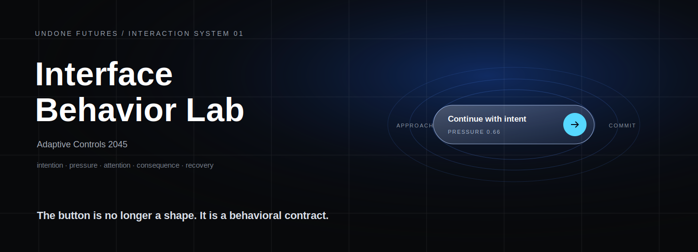
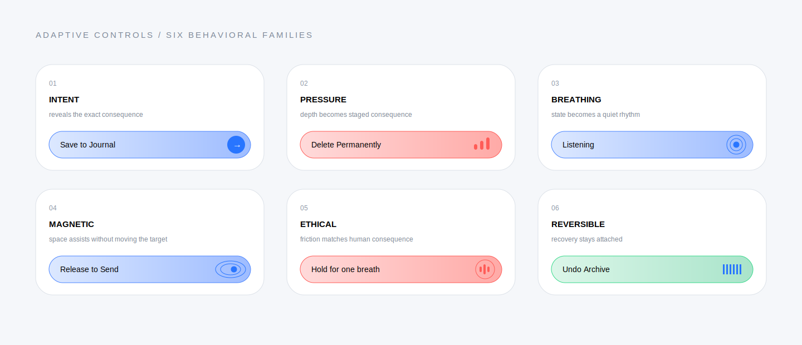

<p align="center">
  
</p>

# Interface Behavior Lab

**A speculative, implementation-minded interaction system for interfaces that understand intention, pressure, attention, consequence, and recovery.**

[Launch the coded playground](https://amydojo.github.io/interface-behavior-lab/) · [Explore the Figma system](https://www.figma.com/design/4jIfeqwhalMPugSAuVtvSi) · [Read the principles](docs/principles.md) · [See the component specifications](components/README.md)

> Independent design research by Amy Do / UNDONE by design. This is not an Apple product, is not affiliated with Apple, and does not represent a prediction of an official operating system.

## The premise

The future button is not a prettier pill.

It is a small negotiation between the user’s intention, the system’s intelligence, the surrounding context, and what happens next. Conventional buttons flatten all of that into one binary moment: tap or do not tap. Adaptive Controls explores what becomes possible when a control can communicate more without becoming harder to understand.

## Coded playground · V1.1

The browser laboratory implements all six behavioral families as live React and TypeScript experiments.

- Light, Dark, and Spatial material modes
- Global Reduce Motion control
- Pointer, touch, voice, and switch modality context
- Adjustable magnetic assistance strength
- Live state transition and event instrumentation
- Stable native button targets and visible focus treatment
- Accessible alternatives for pressure and deliberate-hold interactions
- Responsive layout for desktop and mobile

### Run locally

```bash
npm install
npm run dev
```

Validate a production build:

```bash
npm run typecheck
npm run build
npm run preview
```

## Six behavioral families

| Family | Live behavior | Primary value |
| --- | --- | --- |
| [Intent](components/intent-button.md) | Focus, hover, or first tap reveals the exact consequence | Specificity |
| [Pressure](components/pressure-button.md) | Explicit thresholds and elapsed hold simulate staged input honestly | Intentionality |
| [Breathing](components/breathing-button.md) | Ready, listening, processing, and complete states use restrained rhythm | Ambient state |
| [Magnetic](components/magnetic-button.md) | Pointer distance changes a local field while the target remains fixed | Reduced motor effort |
| [Ethical](components/ethical-button.md) | Consequence appears before proportional resistance and commitment | Informed agency |
| [Reversible](components/reversible-button.md) | The original target becomes its own accessible undo window | Recovery |

<p align="center">
  
</p>

## One action lifecycle

```text
Approach      Clarify      Weigh       Commit      Resolve      Recover
Magnetic  →   Intent   →   Ethical  →  Pressure  → Breathing → Reversible
assist        name         inform      act         confirm      undo
```

The families are different moments in one action language, not six unrelated visual effects. Read the complete model in [Interaction Lifecycle](docs/interaction-lifecycle.md).

## Design principles

- **A control is a contract.** It communicates what it understands, what it will do, and how reversible the result is.
- **Friction matches consequence.** Public, destructive, financial, privacy, and safety actions should not feel identical to reversible ones.
- **State without spectacle.** Readiness and processing are expressed through material behavior without demanding attention.
- **Recovery is part of the action.** Undo remains spatially attached to the decision that created it.
- **Novelty is not a use case.** Adaptive behavior exists only when it reduces ambiguity, accidental activation, motor effort, or recovery cost.

## Honest simulation boundaries

The coded lab does not pretend the browser has capabilities it does not have.

- Elapsed hold time is not labeled physical pressure.
- Pointer proximity is not described as validated gaze behavior.
- Haptics are optional progressive enhancement, not a required signal.
- Motion never carries state alone.
- A conventional and keyboard-operable path remains available.

These components are **testable interaction hypotheses**, not inevitable interface truths.

## System snapshot

| Foundation | V1.1 |
| --- | ---: |
| Live behavioral families | 6 |
| Figma component variants | 46 |
| Design variables | 95 |
| Semantic modes | Light, Dark, Spatial |
| Minimum target | 44 × 44 px |
| Runtime | React + TypeScript + native CSS |

## Repository map

```text
interface-behavior-lab/
├── src/                     coded interaction laboratory
│   ├── components/          six behavioral demos and lab utilities
│   ├── App.tsx              environment, lifecycle, and instrumentation
│   └── styles.css           material system and responsive behavior
├── public/                  browser assets
├── components/              written component specifications
├── docs/                    principles, lifecycle, motion, accessibility
├── tokens/                  portable JSON foundations
├── .github/workflows/       typecheck, build, and Pages deployment
└── README.md
```

## Accessibility baseline

Every adaptive control remains understandable and operable when its novel input or motion layer is unavailable.

- Stable activation target
- Named textual state
- Keyboard, voice, and switch-equivalent path
- Consequence stated before commitment
- Reduced-motion substitute
- Recovery at least as reachable as the original action

Read the full [Accessibility Contract](docs/accessibility.md).

## Status

**V1.1 — coded interaction laboratory**

Next: compare these behaviors against conventional controls, measure failure, and retire any concept that is merely delightful rather than useful.

## License

Available under the [MIT License](LICENSE). Project names, artwork, and written attribution should remain intact when the work is presented as a direct adaptation.
